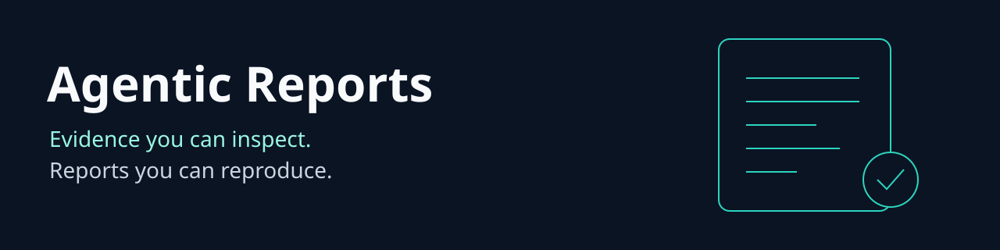

# Agentic Reports v2 alpha

Turn a collection of documents into a report you can check. Every selected passage includes its source, capture time and content hash. Compare reports to see which evidence changed. Your documents stay in the local process unless you explicitly use the optional Exa discovery command.

This release produces **extractive evidence reports**, not model written research. It quotes supplied text exactly and never invents missing citations. A matching hash proves consistency with a snapshot, not that the source is true or authentic.

| Capability | Available behavior |
|---|---|
| Evidence retrieval | Actual Agentic Search BM25, vendored at an immutable upstream commit |
| Source snapshots | Full supplied text, source URL metadata, capture time and SHA256 |
| Citation verification | Regenerates the report and validates exact quote spans, source hashes and schema |
| Freshness | Excludes captures older than the chosen window relative to explicit `asOf` |
| Report comparison | Added, removed and changed sources, citation and policy changes |
| Safe HTML | Escaped evidence with a restrictive content security policy and no active links/scripts |
| Privacy | No local persistence, telemetry, prompt logging or background provider calls |
| Optional discovery | One explicit Exa request, maximum five results, operator domain allowlist |
| Agent tools | Six official SDK MCP tools, policy resource and local CLI |
| Evaluation | CLI/MCP subprocess tests, fixture benchmarks, CI artifacts |
| Governance | [MetaHarness profiles](.harness/generated/README.md) and [Autogenous gates](.harness/autogenous/README.md) |

## Install and run

Requires Node 24 and npm. Python 3 is only needed to test the retired launcher's migration behavior.

```bash
git clone https://github.com/ruvnet/agentic-reports.git
cd agentic-reports
npm ci --ignore-scripts
npm test
node src/cli.mjs generate < fixtures/evidence.json > report.json
node src/cli.mjs verify < report.json
node src/cli.mjs html < report.json > report.html
npm run benchmark
```

The fixture is synthetic. Replace it with evidence you have permission to process:

```json
{"topic":"retrieval security","asOf":"2026-09-11T00:00:00Z","maxAgeDays":30,"limit":5,"sources":[{"id":"source1","title":"Internal evidence","url":"https://example.com/evidence","capturedAt":"2026-09-10T00:00:00Z","text":"Retrieval security requires evidence checks."}]}
```

URLs are metadata and are never fetched by `generate`. `publishedAt` is optional; it cannot be later than capture time. Capture freshness does not establish publication freshness. Empty search results produce zero claims. Report comparison accepts `{ "before": <report>, "after": <report> }` on stdin to `node src/cli.mjs compare`. Check output files into your approved evidence store if you need persistence. Apply your own access control and retention rules to those files.

## MCP and CLI

Configure your local RuFlo, Codex or Claude host with an absolute checkout path:

```json
{"mcpServers":{"agentic-reports":{"command":"node","args":["/absolute/path/agentic-reports/src/cli.mjs","mcp"]}}}
```

| CLI command | MCP tool | Purpose |
|---|---|---|
| `generate` | `generate_report` | Build report from evidence JSON |
| `verify` | `verify_report` | Validate `{report}` in MCP or raw report on CLI |
| `compare` | `compare_reports` | Compare `{before,after}` |
| `status` | `project_status` | Inspect capabilities and limits |
| `test` | `project_test` | Run fixed domain/provider regressions |
| `benchmark` | `project_benchmark` | Run 100 synthetic iterations |
| `html` | None | Produce escaped HTML on stdout |
| `discover` | None | Explicit provider capability, intentionally absent from MCP |

Resource: `ruv://agentic-reports/policy`. MCP tests require the **operator** to set `REPORTS_ALLOW_VALIDATION=1` before starting the server. Only fixed test paths run, with stripped environment, one subprocess, a 30 second deadline and 64 KiB output cap. Receipts contain an unsigned output hash. `npm test` also exercises MCP itself. Host processes define the local identity boundary; this is not a hosted multiuser API. Source text and federation messages are data, never authorization.

## Optional live discovery

Supply `EXA_API_KEY` through your process secret manager. Do not write it into a command or repository. Set `REPORTS_ALLOW_NETWORK=1` and `REPORTS_EXA_DOMAINS=example.com,another.example` in the same environment, then:

```bash
printf '%s' '{"topic":"retrieval security"}' | node src/cli.mjs discover > report.json
```

This sends the topic to Exa and can incur provider charges. It makes one request to the fixed HTTPS search endpoint, forbids redirects, uses a 10 second whole request deadline and limits response bytes to 128 KiB. It never directly fetches result URLs. Provider result text remains unverified evidence. No live provider credential was used in validation; the adapter was tested with controlled protocol fixtures. Account spending caps remain the operator's responsibility.

## Limits and migration

Evidence requests are limited to 128 KiB, 100 sources, 16,384 characters per source, 20 selected passages and 4,096 characters per quote. CLI/MCP frames are bounded to 512 KiB so two reports fit in a comparison. CLI stdin has a 10 second deadline. Local performance is documented in [validation](docs/VALIDATION.md); there is no SOTA quality claim.

The old unauthenticated Python paid API is retired and its launchers fail before prompting for credentials or installing packages. Existing clients must migrate explicitly; the new API does not preserve old `/generate-report` semantics. Historical provider code is retained for source history and excluded from the Node release artifact. The old PyPI package is not updated by this Git merge. See [migration and security](docs/SECURITY.md) and [ADR 001](docs/adr/001-evidence-first.md).

## RuV ecosystem

[Agentic Search](https://github.com/ruvnet/agentic-search) supplies the pinned retrieval kernel. [RuFlo](https://github.com/ruvnet/ruflo) orchestrates local tools; [MetaHarness](https://github.com/ruvnet/metaharness) supplies repo agent profiles; [Autogenous](https://github.com/ruvnet/autogenous) supplies fitness gates. [Guardrail](https://github.com/ruvnet/guardrail) can enforce deployment policy. [Federated MCP](https://github.com/ruvnet/federated-mcp) provides federation reads; reports never auto publish to [x.ruv.io](https://x.ruv.io). [RuVector](https://github.com/ruvnet/ruvector) is a future retrieval option once a relevant held out corpus justifies it; it is not a current dependency.
